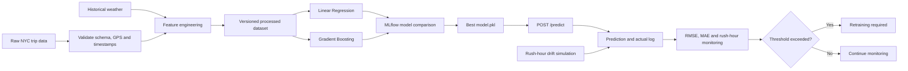

# Ride ETA Prediction

Student project for predicting NYC taxi trip duration from trip time, pickup and
drop-off coordinates, distance, rush-hour status, and weather.

## Objectives and implementation

| Week | Objective | Implementation |
|---|---|---|
| 1 | Ingest, validate, engineer features, version data | `src/data_preprocessing.py` validates the trip schema, timestamps, GPS coordinates and trip values; creates time, distance, rush-hour and weather features; and writes a quality report plus dataset hash. |
| 2 | Compare models and track experiments | `src/train_model.py` compares Linear Regression and Gradient Boosting using RMSE, MAE and R². Parameters and metrics are saved in MLflow. |
| 3 | Package and serve the best model | The lower-RMSE model is saved as `models/best_model.pkl`. `src/app.py` serves it through `POST /predict`. |
| 4 | Log errors, simulate drift, monitor and trigger retraining | Predictions and optional actual durations are logged to JSONL. `src/simulate_drift.py` simulates a rush-hour surge. `src/monitoring.py` reports error metrics and sets `retrain_required`. |

## Project flow



## Setup

The two large CSV files use Git LFS:

```bash
git lfs install
git lfs pull

python3 -m venv .venv
source .venv/bin/activate
pip install -r requirements.txt
```

## Run each week

### Week 1: data preparation

Download the historical daily NYC weather used by the weather feature, then
prepare the dataset:

```bash
python -m src.fetch_weather
python -m src.data_preprocessing --require-weather
```

Outputs:

- `data/processed/processed_data.csv`
- `data/processed/dataset_metadata.json`
- `reports/data_quality_report.json`

### Week 2: model training

```bash
python -m src.train_model
```

Outputs:

- `models/best_model.pkl`
- `models/model_metadata.json`
- `reports/model_comparison.json`
- MLflow runs in `logs/mlflow.db`

View the experiments with:

```bash
mlflow ui --backend-store-uri sqlite:///logs/mlflow.db
```

### Week 3: REST API

```bash
uvicorn src.app:app --reload
```

Interactive API documentation is available at `http://127.0.0.1:8000/docs`
(Swagger UI) and `http://127.0.0.1:8000/redoc` (ReDoc).

Example request:

```bash
curl -X POST http://127.0.0.1:8000/predict \
  -H 'Content-Type: application/json' \
  -d '{
    "pickup_datetime": "2016-06-15T18:30:00",
    "pickup_latitude": 40.7580,
    "pickup_longitude": -73.9855,
    "dropoff_latitude": 40.7308,
    "dropoff_longitude": -73.9973,
    "weather": "rainy",
    "actual_duration": 900
  }'
```

`actual_duration` is optional and is measured in seconds. When supplied, the
API also records the prediction error for Week 4 monitoring. ETA is returned in
both seconds and minutes.

### Week 4: monitoring and drift

```bash
python -m src.simulate_drift
python -m src.monitoring --predictions logs/drift_predictions.jsonl
```

The monitoring report contains prediction count, labeled count, RMSE, MAE,
rush-hour share, drift status and `retrain_required`.

## Notebook walkthroughs

The `notebooks/` directory contains runnable walkthroughs for the three main
development stages:

- `01_data_exploration.ipynb` explores data quality and trip distributions.
- `02_feature_engineering.ipynb` demonstrates the engineered time, distance,
  rush-hour and weather features.
- `03_model_experiments.ipynb` compares candidate models and their MLflow runs.

Start Jupyter from the project root with `jupyter notebook` and open the desired
notebook.

## Run the complete pipeline

```bash
python -m src.main --simulate-drift
```

## Tests

```bash
pytest
```

## Submission demo and recording

The script below runs the important checks in rubric order and saves the
terminal results in `submission_evidence/`:

```bash
bash scripts/run_submission_demo.sh
```

It performs these steps:

1. Runs the automated tests.
2. Runs Week 1 preprocessing and displays the validation counts.
3. Trains both Week 2 models and displays their comparison.
4. Starts the API locally, sends one real request, and saves the response.
5. Runs the Week 4 rush-hour simulation and monitoring check.
6. Copies the final JSON reports into `submission_evidence/`.

The command produces:

```text
submission_evidence/
├── 01_tests.txt
├── 02_data_preprocessing.txt
├── 03_model_training.txt
├── 04_api_server.txt
├── 04_api_response.json
├── 05_drift_simulation.txt
├── 06_monitoring.txt
├── data_quality_report.json
├── model_comparison.json
└── drift_simulation_report.json
```

For the screen recording, show the flow diagram first, run the script from the
project root, and highlight the following lines when they appear:

- `passed` in the test output
- the number of accepted and rejected rows
- `selected_model: gradient_boosting`
- the API's `predicted_eta_minutes`
- `drift_detected: true`
- `retrain_required: true`

The complete demo normally takes less than a minute on the supplied dataset.
